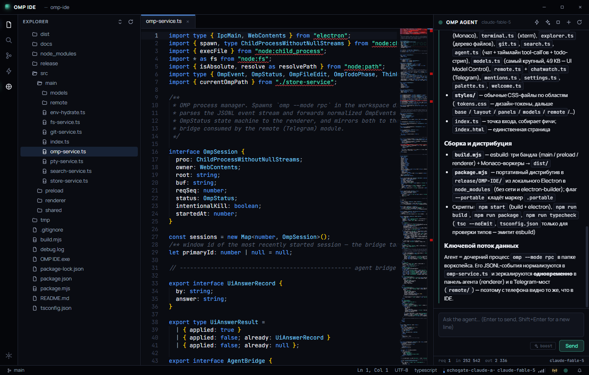
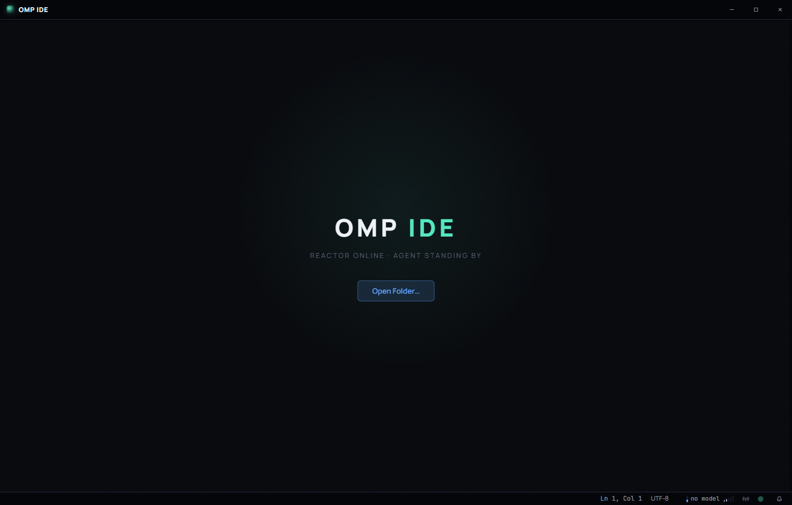

# OMP IDE

Десктопная IDE для агент-харнесса **Oh My Pi**: редактор кода, терминал и
AI-агент в одном окне. Агент видит ваш воркспейс, читает, правит и запускает
код — а вы наблюдаете каждое действие в реальном времени.

Electron + Monaco (движок VS Code) + xterm.js. Windows x64.



## Возможности

### Редактор и воркспейс
- **Monaco Editor** — подсветка, автодополнение, hover-подсказки, minimap (тот же движок, что в VS Code)
- **Explorer** — дерево файлов с live-обновлением (chokidar), git-статусы файлов
- **Поиск по проекту** — ripgrep под капотом
- **Git-панель** — статус, диффы, ветка в статус-баре
- **Встроенный терминал** — полноценный PTY (xterm.js + node-pty)
- **Командная палитра** — `Ctrl+Shift+P`, быстрое открытие файла — `Ctrl+P`
- Несколько окон — каждое со своим воркспейсом

### AI-агент
- Панель **OMP Agent**: чат с агентом о вашем проекте — он читает, редактирует и запускает код
- Таймлайн tool-call'ов: каждое действие агента (чтение файла, правка, команда) видно в ленте
- Todo-стрип с прогрессом задач агента
- Диалоги-запросы от агента (уточняющие вопросы) прямо в UI

### Model Control
- Профили провайдеров из `~/.omp/agent/models.yml` — нативная адресация `<profile>/<model>`, без слоя трансляции
- Роли моделей, уровни thinking, избранное
- **Auto-swap engine** — автоматический failover между профилями с одной и той же моделью при исчерпании квоты; уровень thinking сохраняется, запрос доводится до конца
- **Баланс кошелька** — probe-запросы к API провайдера, индикатор в статус-баре
- Классификатор ошибок провайдера (квота / авторизация / сеть)

### Remote Control (Telegram)
- Подключение Telegram-ботов: управляйте агентом с телефона, пока IDE запущена
- Токены хранятся зашифрованными через OS keychain (`safeStorage`)
- Дайджесты, вопросы агента и сводки — прямо в чат; поддержка SOCKS/HTTPS-прокси

## Скриншоты

| Стартовый экран | Воркспейс с агентом |
|---|---|
|  |  |

## Установка (портативная версия)

1. Скачайте `omp-ide-<версия>-win-x64.zip` из [Releases](https://github.com/Ran1sss/OMP-IDE/releases)
2. Распакуйте в любую папку
3. Запустите `OMP IDE.exe`

Установка не требуется. Все настройки, токены и кэши хранятся в папке `data`
рядом с exe (portable-режим) — приложение не трогает `%APPDATA%`.

Можно также открыть папку сразу из командной строки:

```sh
"OMP IDE.exe" C:\path\to\project
```

## Сборка из исходников

Требования: **Node.js 20+**, Windows x64.

```sh
npm install
npm start            # сборка + запуск electron
npm run build        # только сборка (esbuild -> dist/)
npm run typecheck    # проверка типов
```

### Портативная сборка

```sh
npm run package                                  # userData в %APPDATA%\OMP IDE
node build.mjs && node package.mjs --portable    # userData в ./data рядом с exe
```

Результат — `release/OMP-IDE/`: самодостаточная папка с `OMP IDE.exe`,
которую можно перенести куда угодно и запустить без установки. Никакой сети
и electron-builder не нужно — используется локальный Electron из `node_modules`.

С флагом `--portable` в сборку кладётся маркер `.portable`: все настройки,
токены и кэши хранятся в `./data` рядом с exe — такую папку можно
заархивировать и отдать другому человеку (удалив `data`, если успели
поработать в ней).

## Архитектура

```
src/main/                 главный процесс Electron
  index.ts                окна, portable-режим, CLI-аргументы
  fs-service.ts           файловые операции + вотчеры (chokidar)
  pty-service.ts          терминальные сессии (node-pty)
  search-service.ts       поиск по проекту (ripgrep)
  git-service.ts          git-статус и диффы
  omp-service.ts          менеджер процесса omp (--mode rpc, JSONL-события)
  store-service.ts        настройки, layout'ы, недавние воркспейсы
  models/                 Model Control: профили, swap-engine, баланс,
                          классификатор ошибок, thinking-уровни
  remote/                 Telegram-модуль: боты, пейринг, роутинг,
                          дайджесты, зашифрованный vault токенов
src/preload/index.ts      contextBridge — типизированный IPC API (window.ide)
src/renderer/             UI: ядро (state, bus, commands, палитра) +
                          фичи (editor, terminal, explorer, git, agent,
                          models, remote, search, settings)
src/shared/types.ts       общие типы IPC-контракта
build.mjs                 esbuild: main/preload/renderer + Monaco-воркеры
package.mjs               портативный дистрибутив без electron-builder
```

Главный процесс общается с renderer только через типизированный IPC
(`contextIsolation: true`, `nodeIntegration: false`). Агент запускается как
дочерний процесс `omp --mode rpc` в папке воркспейса; его JSONL-поток событий
нормализуется и зеркалируется одновременно в панель агента и в
Telegram-мост.

## Горячие клавиши

| Комбинация | Действие |
|---|---|
| `Ctrl+P` | открыть файл |
| `Ctrl+Shift+P` | командная палитра |
| `` Ctrl+` `` | терминал |

## Лицензия

Приватный проект. Chromium/Electron распространяются по своим лицензиям
(см. `LICENSES.chromium.html` в дистрибутиве).
